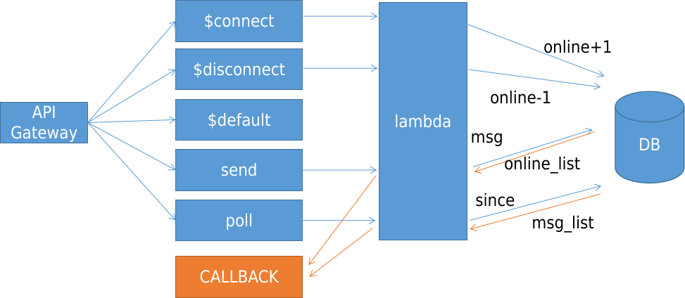

## Architecture



## Context Examples

### 1. $connect
```python
{'headers': {'Host': 'aabbccdd.execute-api.ap-northeast-1.amazonaws.com',
  'Sec-WebSocket-Extensions': 'permessage-deflate; client_max_window_bits',
  'Sec-WebSocket-Key': 'asdfasdfasdf==',
  'Sec-WebSocket-Version': '13',
  'X-Amzn-Trace-Id': 'Root=1-1234567-789787678380254fd2a14',
  'X-Forwarded-For': '123.45.123.45',
  'X-Forwarded-Port': '443',
  'X-Forwarded-Proto': 'https'},
 'multiValueHeaders': {'Host': ['aabbccdd.execute-api.ap-northeast-1.amazonaws.com'], ... },
 'requestContext': {'routeKey': '$connect',
  'eventType': 'CONNECT',
  'extendedRequestId': 'PJqB0E1tKRcF-Qw=',
  'requestTime': '29/Nov/2023:08:04:01 +0000',
  'messageDirection': 'IN',
  'stage': 'production',
  'connectedAt': 1701245041796,
  'requestTimeEpoch': 1701245041798,
  'identity': {'sourceIp': '123.45.123.45'},
  'requestId': 'PJqB0E1tKRcF-Qw=',
  'domainName': 'aabbccdd.execute-api.ap-northeast-1.amazonaws.com',
  'connectionId': 'PJqB0fHsqRcCHlw=',
  'apiId': 'aabbccdd'},
 'isBase64Encoded': False}
```

### 2. routeKey (sendMessage)
```python
{'requestContext': {'routeKey': 'sendMessage',
  'messageId': 'PJqCFfHyKRcCHlw=',
  'eventType': 'MESSAGE',
  'extendedRequestId': 'PJqCFEqHqRcFd0w=',
  'requestTime': '29/Nov/2023:08:04:03 +0000',
  'messageDirection': 'IN',
  'stage': 'production',
  'connectedAt': 1701245041796,
  'requestTimeEpoch': 1701245043417,
  'identity': {'sourceIp': '123.45.123.45'},
  'requestId': 'PJqCFEqHqRcFd0w=',
  'domainName': 'aabbccdd.execute-api.ap-northeast-1.amazonaws.com',
  'connectionId': 'PJqB0fHsqRcCHlw=',
  'apiId': 'aabbccdd'},
 'body': '{"action":"sendMessage", body:"hello"}',
 'isBase64Encoded': False}
```

### 3. $default
```python
{'requestContext': {'routeKey': '$default',
  'messageId': 'PJpDXchdqRcCJCA=',
  'eventType': 'MESSAGE',
  'extendedRequestId': 'PJpDXEc6KRcFiJQ=',
  'requestTime': '29/Nov/2023:07:57:22 +0000',
  'messageDirection': 'IN',
  'stage': 'production',
  'connectedAt': 1701244639136,
  'requestTimeEpoch': 1701244642032,
  'identity': {'sourceIp': '123.45.123.45'},
  'requestId': 'PJpDXEc6KRcFiJQ=',
  'domainName': 'aabbccdd.execute-api.ap-northeast-1.amazonaws.com',
  'connectionId': 'PJpC6chVKRcCJCA=',
  'apiId': 'aabbccdd'},
 'body': 'hello',
 'isBase64Encoded': False}
```

### 4. $disconnect
```python
{'headers': {'Host': 'aabbccdd.execute-api.ap-northeast-1.amazonaws.com',
  'x-api-key': '',
  'X-Forwarded-For': '',
  'x-restapi': ''},
 'multiValueHeaders': {'Host': ['aabbccdd.execute-api.ap-northeast-1.amazonaws.com'],
  'x-api-key': [''],
  'X-Forwarded-For': [''],
  'x-restapi': ['']},
 'requestContext': {'routeKey': '$disconnect',
  'disconnectStatusCode': 1005,
  'eventType': 'DISCONNECT',
  'extendedRequestId': 'PJqCOG4zqRcFcPw=',
  'requestTime': '29/Nov/2023:08:04:04 +0000',
  'messageDirection': 'IN',
  'disconnectReason': 'Client-side close frame status not set',
  'stage': 'production',
  'connectedAt': 1701245041796,
  'requestTimeEpoch': 1701245044314,
  'identity': {'sourceIp': '123.45.123.45'},
  'requestId': 'PJqCOG4zqRcFcPw=',
  'domainName': 'aabbccdd.execute-api.ap-northeast-1.amazonaws.com',
  'connectionId': 'PJqB0fHsqRcCHlw=',
  'apiId': 'aabbccdd'},
 'isBase64Encoded': False}
```

## connect
`wscat -c wss://aabbccddee.execute-api.ap-northeast-1.amazonaws.com/production/`
